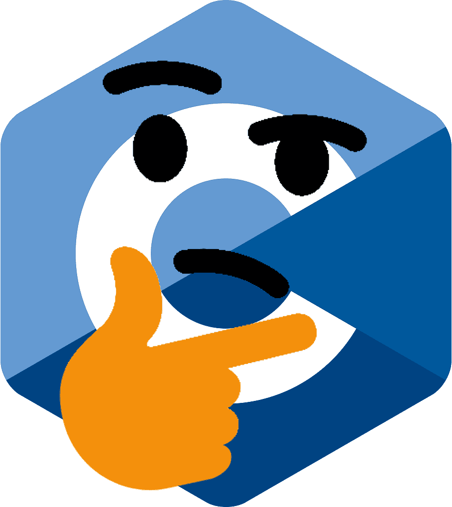
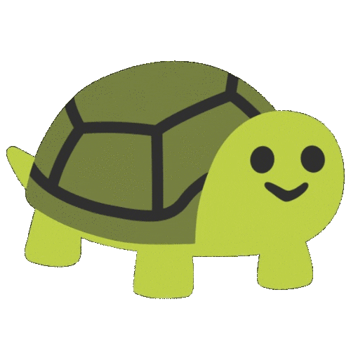

# Projet M2101 - Sokoban (2020 - 2021)
> Un projet réalisé par **Amaury VANOORENBERGHE**, **Hugo ROUX** et **Néo ALMEIDA**

</img>

-----

## Rapport de projet

Lors de la réalisation de ce projet, nous avons pu rencontrer plusieurs problèmes et difficultés prévues:

- Nous avons en premier lieu eu des difficultés en rapport avec des erreurs de segmentation (`Segmentation fault (core dumped)`)  

	Résoudre ces erreurs étaient compliquées car contrairement à des langages plus haut niveau, on ne sait pas quelle ligne de code a causé l'erreur, rendant le débogage plus lent.

- Nous avons aussi rencontré certains problèmes liés aux disponibilités de chacun, ce qui a failli etraver la réussite du projet.

- L'insertion d'un nouveau score dans le top 5 a aussi été compliquée à deboguer car il nous a fallu gérer tous les cas particuliersz (ajout d'un score si la liste est pleine, modifier un score existant, ...).

- De part nos différentes disponibilités et le fait que chacun progressait a une vitesse différente, nous avons décidé pour ne pas se "voler" le travail entre membres de l'équipe, de travailler sur une interface textuelle via la librairie ncurses en bonus. Ce bonus s'est avéré très utile pour ne pas avoir a appuyer sur entrée à chaque déplacement.

Ci-dessous, une image de tortue (c'est cadeau)

</img>

