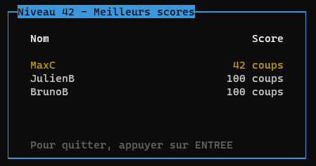
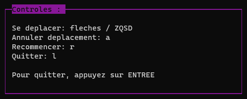
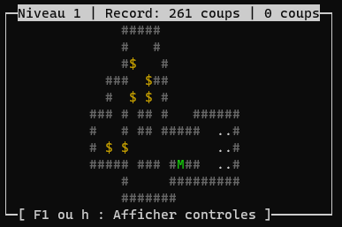

# Projet m2101 - BanSoko
> Projet réalisé par
[ALMEIDA Néo](https://github.com/Ninhache), 
[ROUX Hugo](https://github.com/Yugogo-git) et 
[VANOORENBERGHE Amaury](https://github.com/REHERC)
- Commencé le : 18/03/2021
- Fin le : 12/04/2021

## Explications :  
Dans le cadre d'un projet universitaire, nous avons recréer le jeu [Sokoban](https://fr.wikipedia.org/wiki/Sokoban), un jeu de réfléxion et de puzzle qui nous vient tous droit du Japon !
Vous pouvez tester le jeu sur navigateur vous-mêmes, en passant par ce **[lien](https://sokoban.info/)**

## Règles du jeu :
Les règles du jeu sont simples !
Vous incarnez un personnage qui se doit de ranger des caisses !  
Et pour ranger ces caisses... Il suffit de les pousser sur les emplacements correspondant.
Mais attention !
Il lui est impossible de :
- Tirer une caisse
- Pousser deux caisses
- Pousser trois caisses
- Casser les murs 
- Se téléporter
- Finir le jeu <span></span>
</br>

## Installation :
Il suffit de télécharger le code, où de cloner le git avec ce lien :
```
https://github.com/Yugogo-git/Sokoban.git
```
Vous pouvez ensuite utiliser la commande `make` pour compiler, et lancer l'executable créer, qui se situe dans le dossier build.  
Ou sinon, utilisez la commande `make run` qui permet de compiler et d'executer le programme en "même temps"

> **ATTENTION !**

Ce projet utilise la librairie NCurses, pour pouvoir compiler le programme, il est nécessaire d'installer les dépendances. Pour les utilisateurs du gestionnaire de packetages apt, vous pouvez installer les dependances avec `sudo make install-dev-with-apt`

## Images du jeu fini !
</br>





> Liste des niveaux disponible dans banSoko :
```
0, 1, 2, 3, 4, 5, 6, 7, 8, 9, 10, 11, 12, 13, 14, 15, 16, 17, 18, 19, 20, 21, 22, 23, 24, 25, 42, 666, 667, 1402, 10000
```

## Librairies utilisées

Librairies standard  
Utilisation de Ncurses pour la partie "graphique"  

[](https://www.univ-lille.fr/)