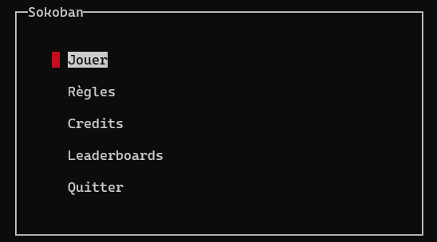
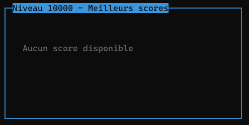

# BanSoko
- Commencé le : 18/03/2021
- Fin le : 12/04/2021

## Explications :  
Dans le cadre d'un projet scolaire, nous devions recréer le jeu [Sokoban](https://fr.wikipedia.org/wiki/Sokoban), un jeu de réfléxion et de puzzle qui nous vient tous droit du Japon !
Vous pouvez tester le jeu sur navigateur vous même, en passant par ce **[lien](https://sokoban.info/)**

## Règles du jeu :
Les règles du jeu sont simples !
Vous incarnez un personnage qui se doit de ranger chaque niveau !  
Et pour ranger ces niveaux... Il suffit de pousser les caisses sur leurs emplacements ..
Mais attention !
Il lui est impossible de :
- Tirer une caisse
- Pousser deux caisses
- Pousser trois caisses
- Casser les murs 
- Se téléporter
- Finir le jeu 

</br>

## Installation :
Il suffit de télécharger le code, où de cloner le git avec ce lien :
```
https://github.com/Yugogo-git/Sokoban.git
```
Vous pouvez ensuite utiliser la commande `make` pour compiler, et lancer l'executable créer  
Ou sinon, utiliser la commande `make run` qui permet de compiler et d'executer le programme en "même temps"  

## Image du jeu fini !
</br>



## Collaborateurs du projet :  
Nous remercions nos collaborateurs :</br>
[ALMEIDA Néo](https://github.com/Ninhache)</br>
[ROUX Hugo](https://github.com/Yugogo-git)</br>
[VANOORENBERGHE Amaury](https://github.com/REHERC)</br>
<br>
Librairie utilisée :  
Utilisation de Ncurses pour la partie "graphique"  

[](https://www.univ-lille.fr/)


<br>
<br>
<br>